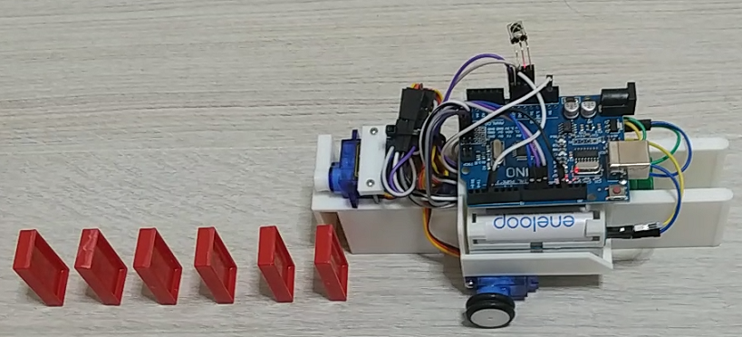

# domino_machine

## Overview
* This machine is a prototype machine that automatically places dominoes.
* Made for practicing servo control by Arduino
* The target domino is "MARUKA Colorful Domino P50"
  * http://www.maruka.jp/toy/toys/detail/?t=1&id=322
  * https://amazon.co.jp/dp/B01CVCGDN2/
  * This Domino is cheap and of poor quality
  * Must be adjusted to stand vertically by scraping domino burrs
* Remote controller operation
  * Center key: Start stop
  * Up / Down key: Domino spacing Narrow / wide
  * Left / Right key: Turn left / right

## Dependent libraries
* IRremote
  * Ver 3.7.1
  * Install using ArduinoIDE Library Manager
* VarSpeed Servo
  * https://github.com/netlabtoolkit/VarSpeedServo
  * Download zip and zip library install using ArduinoIDE Library Manager

## Hardware used
* Arduino UNO (compatible)
  * https://amazon.co.jp/dp/B081DY1H2F/
* TOWER PRO SG90 x1
  * https://amazon.co.jp/dp/B016FKJJ8M/
* TOWER PRO SG90-HV x2
  * https://amazon.co.jp/dp/B07N6JP2XK/
  * 360 degree type
* IR receiver VS1838B
  * https://amazon.co.jp/dp/B09JK5XTF2/
* AA batteries x4
* VKLSVAN MT3608 DC-DC converter
  * Voltage conversion from AA battery x4 to 5V
  * https://amazon.co.jp/dp/B07SHLL77G/
* uxcell O-ring
  * Outer diameter 21 mm, inner diameter 14 mm, cross-sectional diameter 3.5 mm
  * https://amazon.co.jp/dp/B07J4YHTN6/
* M2x20 tapping screw x2
* M3x8 screw x1
* 3D printed model
  * Download my design from Thingiverse

## Arduino wiring
| Arduino Pin | Device | Pin | Remarks |
| --- | --- | --- | --- |
| VIN | DC-DC | OUT+ | set voltage 5V or over |
| GND | DC-DC | OUT- ||
| 5V | VS1838B | VCC ||
| GND | VS1838B | GND ||
| 3 | VS1838B | OUT ||
| 5V | SG90 | Vcc | for arm |
| GND | SG90 | Ground | for arm |
| 9 | SG90 | PWM | for arm |
| 5V | SG90-HV | Vcc | for right wheel |
| GND | SG90-HV | Ground | for right wheel |
| 10 | SG90-HV | PWM | for right wheel |
| 5V | SG90-HV | Vcc | for left wheel |
| GND | SG90-HV | Ground | for left wheel |
| 11 | SG90-HV | PWM | for left wheel |
